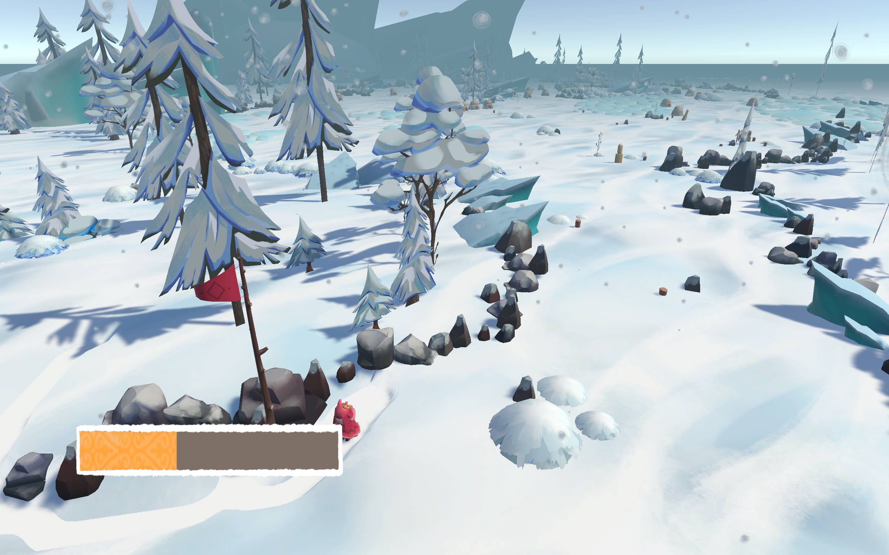

# Passsage

*A contemplative exploration game, made by a team of nine in five days for our third-year back-to-school game week.*

## About

Wander a quiet map at your own pace. A yak follows close behind you, and as you explore, you'll come across the tracks of those who walked before you.
You leave your own mark too: both you and your yak leave tracks in the snow behind you as you walk.

The journey asks you to pace yourself. Walking wears down your stamina, so you'll need to stop and rest to get it back. 
Deep snow is harsher still: wading through it lowers your maximum stamina, so the shortcut isn't always the kindest route. 
Find a campfire to recharge faster and recover what the cold has taken.

## Features

- A map made for slow, unhurried exploration
- A yak companion that follows you wherever you go
- Tracks left behind by earlier travelers, so you're never entirely alone
- A stamina system that rewards patience: stop to recharge, and choose your path carefully
- Deep snow that lowers your maximum stamina the longer you wade through it
- Campfires where you can rest, recharge faster, and restore your maximum stamina
- Original art and sound made entirely within the five days of the jam

## Controls

| Action | Input |
| --- | --- |
| Move | [WASD / Arrow keys] |
